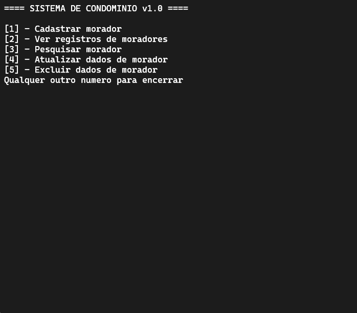
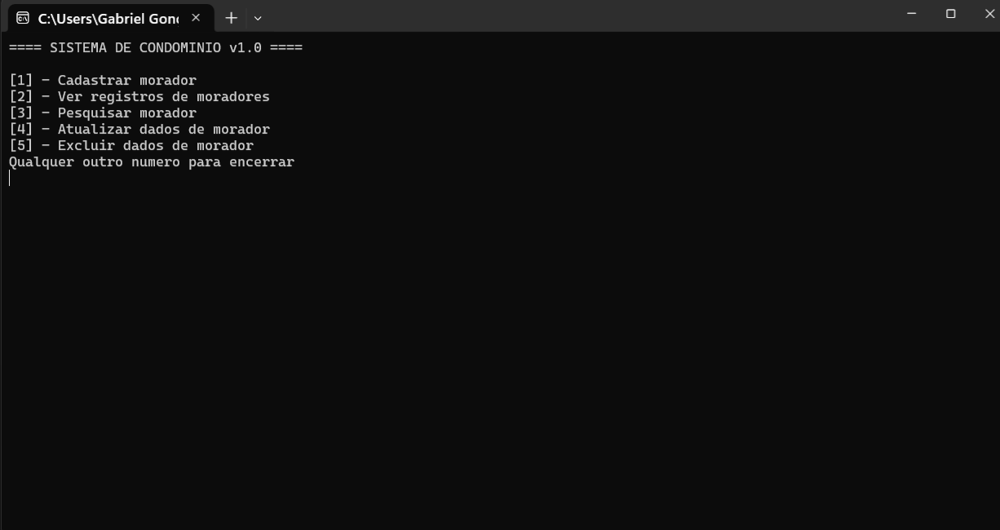
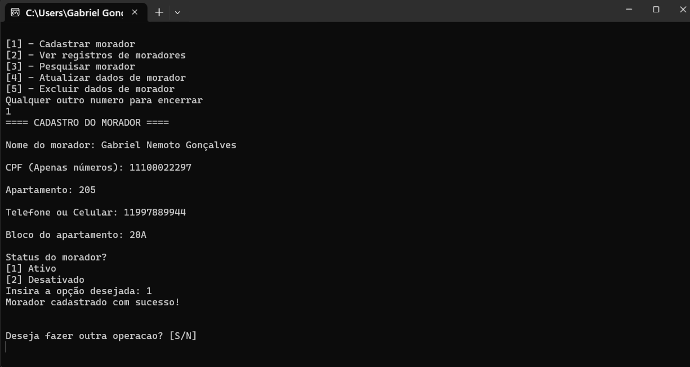
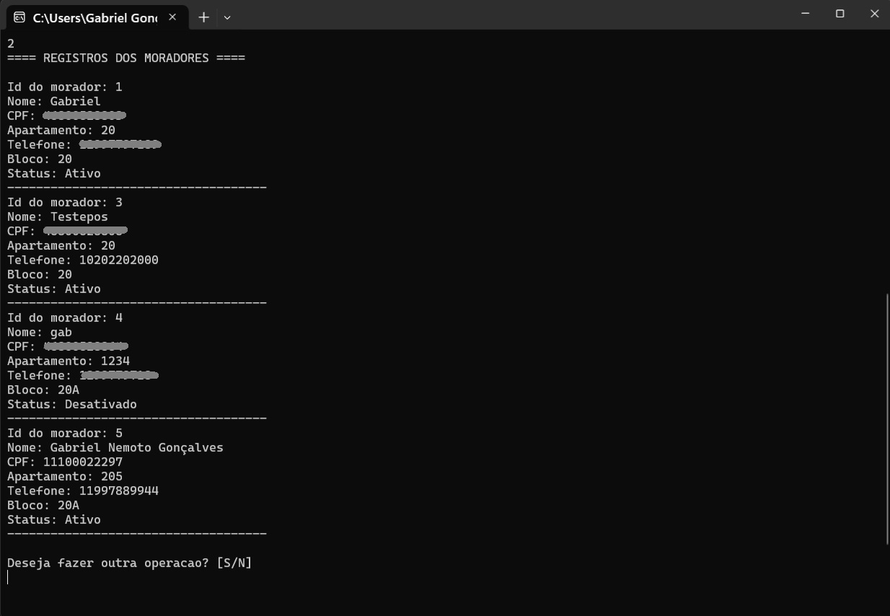
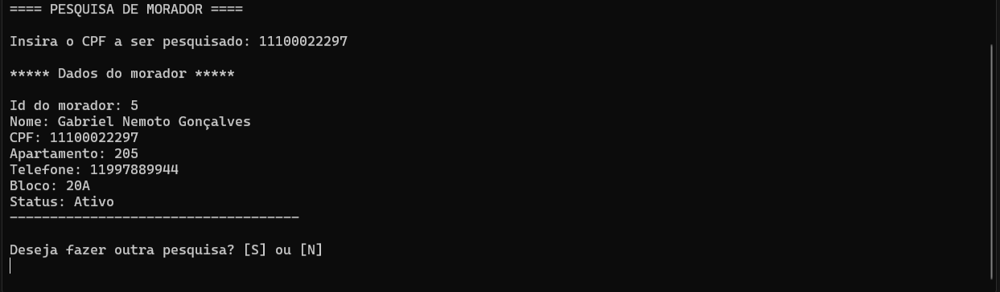
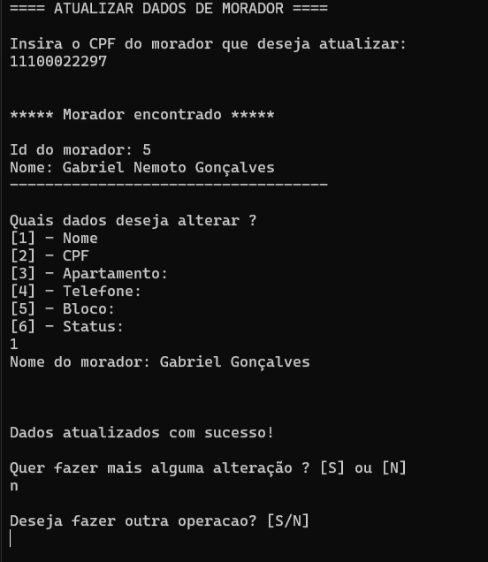
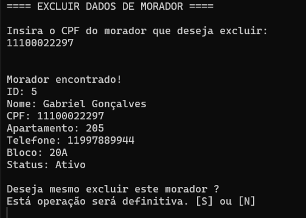
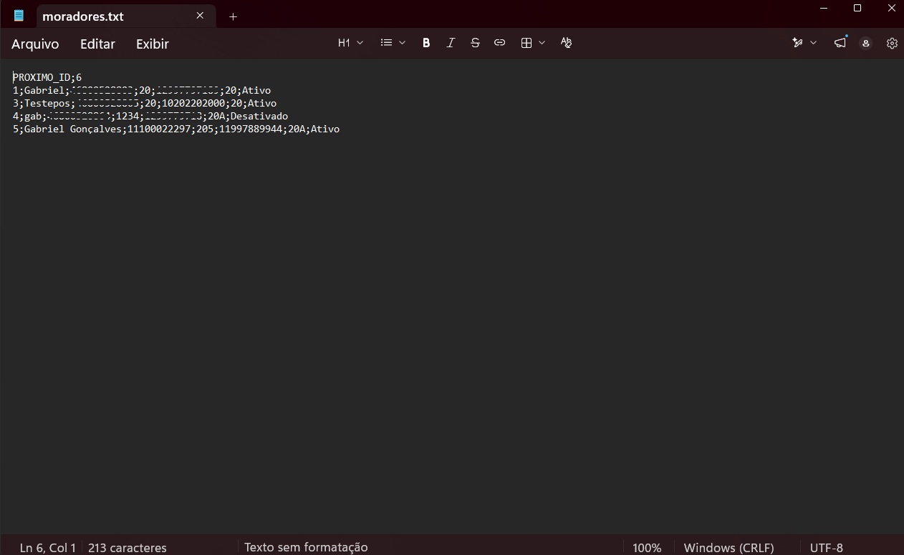

# Sistema de Gerenciamento de Condomínio

Sistema CRUD desenvolvido em C++ para gerenciamento de moradores de um condomínio, com persistência de dados em arquivo TXT, validações de entrada e organização modular do código.

Projeto desenvolvido durante os estudos de Análise e Desenvolvimento de Sistemas.

---

## Objetivo

Desenvolver um sistema CRUD em C++ para aplicar conceitos de programação estruturada, modularização, manipulação de arquivos, validação de dados e persistência de informações.

---

## Índice

- Funcionalidades
- Validações implementadas
- Estrutura do projeto
- Tecnologias utilizadas
- Como compilar
- Como executar
- Demonstração
- Funcionalidades futuras
- Autor

---

## Funcionalidades

- Cadastro de moradores
- Pesquisa por CPF
- Atualização de dados
- Exclusão de moradores
- Persistência em arquivo TXT
- Carregamento automático dos dados
- Geração automática de IDs únicos
- Validação dos campos de entrada

---

## Validações implementadas

### Nome
- Não pode ser vazio
- Mínimo de 3 caracteres
- Não aceita números

### CPF
- Apenas números
- 11 dígitos
- Não permite CPF duplicado
- Não permite sequências iguais (11111111111)

### Apartamento
- Apenas números
- Valores entre 1 e 9999

### Telefone
- Apenas números
- Aceita 10 ou 11 dígitos

### Bloco
- Não pode ser vazio
- Máximo de 3 caracteres

### Status
- Ativo
- Desativado

---

## Estrutura do projeto

```text
Projeto/
│
├── imagens/
│   ├── demo.gif
│   ├── menu.png
│   ├── cadastro.png
│   ├── listagem.png
│   ├── pesquisa.png
│   ├── update.png
│   ├── delete.png
│   └── persistencia.png
│
├── main.cpp
├── crud.cpp
├── crud.h
├── validacoes.cpp
├── validacoes.h
├── arquivo.cpp
├── arquivo.h
├── dados.cpp
├── morador.h
├── README.md
└── .gitignore
```

---

## Tecnologias utilizadas

- C++
- Programação modular (.h/.cpp)
- STL (Standard Template Library)
- std::vector
- std::string
- std::fstream
- std::stringstream
- Git
- GitHub

---

## Como compilar

```bash
g++ *.cpp -o sistema.exe
```

---

## Como executar

```bash
./sistema.exe
```

No Windows:

```bash
.\sistema.exe
```

---

## Demonstração

A animação abaixo apresenta o fluxo principal do sistema.



## Menu principal



## Cadastro de moradores



## Lista de moradores



## Pesquisa de morador



## Update de dados do morador



## Apagar dados do morador



## Persistência em arquivo TXT



---

## Funcionalidades futuras

- Persistência utilizando SQLite
- Interface gráfica (Qt)
- Cadastro de apartamentos
- Cadastro de funcionários
- Reserva de áreas comuns
- Sistema de autenticação (login)

---

## Autor

Gabriel Gonçalves

Estudante de Análise e Desenvolvimento de Sistemas (IFSP)

GitHub: https://github.com/GabrielNemoto

---

## Licença

Projeto desenvolvido para fins acadêmicos e de aprendizado.